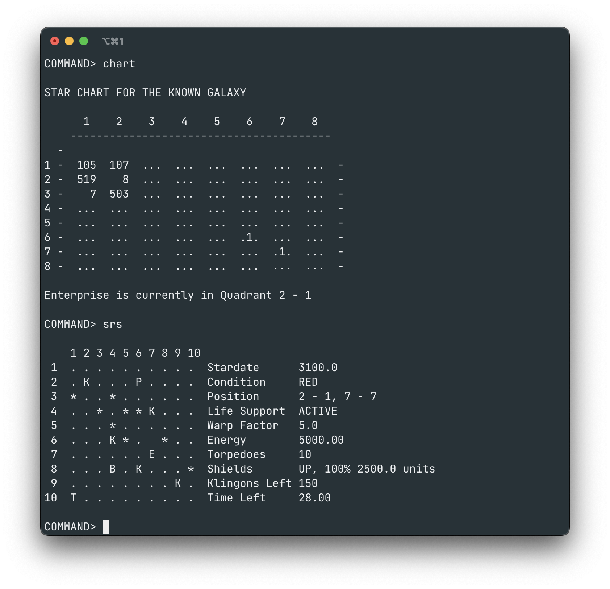

# CECS 478 Lab: Malware Hacking

## Assignment description

We're in the section of the class where we discuss malware, and what better way to practice all of the same skill-set of skills than to do some binary hacking!

[Super Star Trek](https://en.wikipedia.org/wiki/Star_Trek_\(1971_video_game\)) is one of the oldest video games, and one that many hackers of yore remember fondly. It is also one of the earliest strategy games.

Essentially, the game places you as the Captain of the starship Enterprise which was the ship in the original Star Trek series. In those days, Klingons were the bad guys and the Federation were the good guys and *of course* the evil commie pinko Kiingons need to be taken out. So that's what we've got to do before they take us out!

Super Star Trek is a [procedurally generated game](https://en.wikipedia.org/wiki/Procedural_generation), which means that the game will randomly create a "playing field" for the game along with a good amount of random events. The game has quite a few "easter eggs" hidden in it, and I would suggest playing the game for a while to see if you can uncover them. Don't ignore [the manual](sst.txt) either as it will give you a rundown on how to play the game.

Super Star Trek has undergone many iterations over the years, and yours truly [first experienced this fine strategy game](https://archive.org/details/a2_Apple_Trek_1979_Apple) back on an old [Apple II](https://en.wikipedia.org/wiki/Apple_II) computer in school.

My version is different than the one listed above on the Internet Archive. Aside from being the "Super" version found on mainframe computer systems of the day, I have made a few alterations of my own. For instance...

The crew has inadvertantely created a sentient AI and it has taken over the Enterprise! While it will allow you to play the game and attempt to defeat the Klingons, you *must* find the self-destruct password before game's end otherwise the AI will fly the Enterprise to Earth and use it as a weapon to destroy the Federation!

The game has also been set to the most difficult mode, *Emeritus*. Good luck with that... (even the game will say that...and that's not my doing) and I've made a few other alterations to the codebase which make my code unique (and *not* something you can Google and find answers to).

## Requirements
For the assignment, you will need to do a few things:

1. Discover the password which the computer set for the self-destruct process
2. Locate where the password check resides in the program
3. Bypass the password check within the binary so the computer can't change it again on you!
4. Add your name in the credits along with mine

Everything above resides in the one binary file, `sst`. The additional file, `sst.txt` is a README file for the game, and it also serves as in-game documentation (It was a neat idea for 1974, actually).

You will also need a hex editor / debugger for this assignment. There are many different hex editors out there, but I suggest checking out [Ghidra](https://github.com/NationalSecurityAgency/ghidra) and giving the NSA's program a spin. That's how I did it. :-)

Plus, of course, a healthy dose of knowledge from classes like CECS 341 or similar architecture class. You will also need to tinker with this assignment: get creative; try things; make an early copy of your binary file and don't worry about messing it up; experiment; play around with this. Many hackers learn more from *play* than work.

## Some obvious things that shouldn't need to be said, but have to be right now

1. **Don't apply any patches or third-party code to your binary file** other than the code *you* change. A simple run of a `diff` program will easily tell me which pieces have been changed and which haven't.
2. **Do your own work**. Cheating and plagiarism are at all time highs in our department and we are being extra watchful right now.
3. **Come to me if you need help**. Really. I'm surprised people don't do this *more*. There are some things that I won't be able tell you about, but quite a bit that I can.
4. **Have fun with this assignment**. It's *supposed* to be fun. Hard, yes. But the best puzzles are always the hardest ones ;-).

## Deliverables

Here is what I will need from you:

1. Your modified, runnable (in working order) `sst` binary which will include:
   - Your name along with mine in the hacking credits
   - The Enterprise's destruct password *altered in the binary* to bypass the verification.
2. A screenshot of your terminal running the game, with your hacking credit name showing.
3. A write up with the following info:
    - The offsets of the locations changed
    - Which value each offset now contains
    - The original password that was set
    - How you bypassed the password
    - Your experiences with the project
    - Anything else you want to tell me

Your submission must follow the following rules, *else I will not grade it and you will receive a zero for the submission*:

* Do not use compression on your files
* Make sure that all significant code is *commented* with your own explanations
